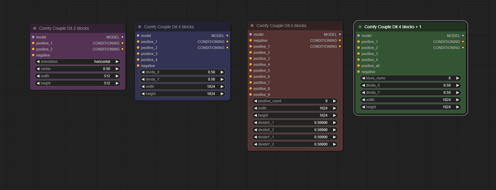
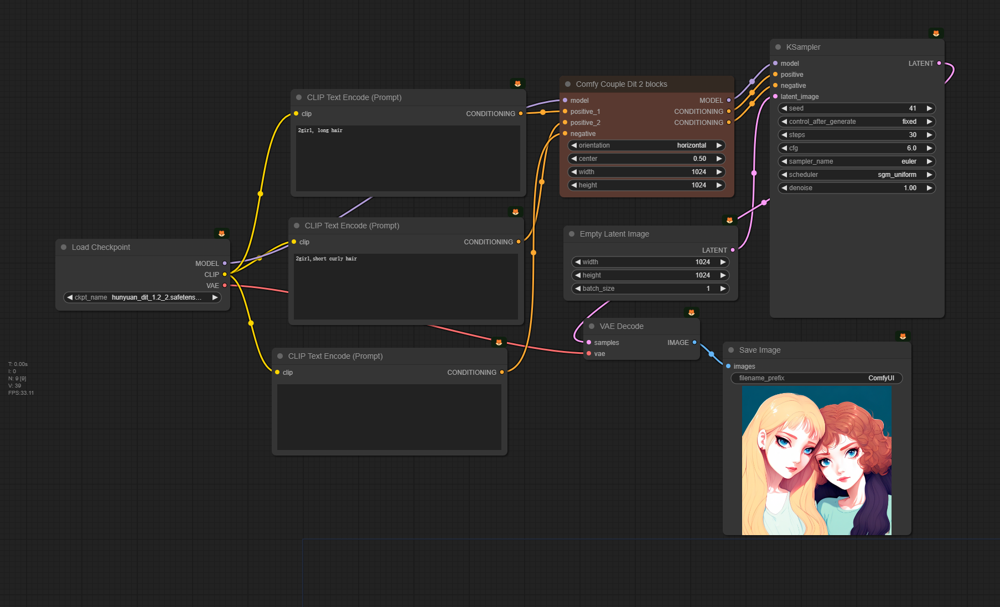
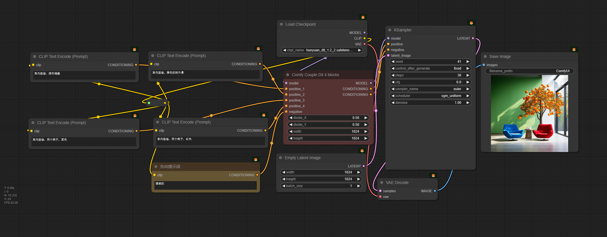
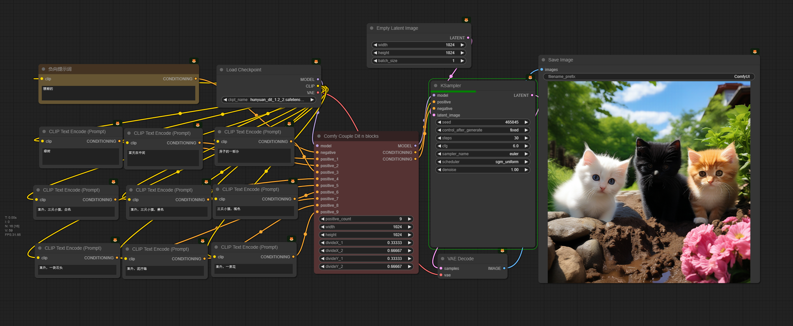
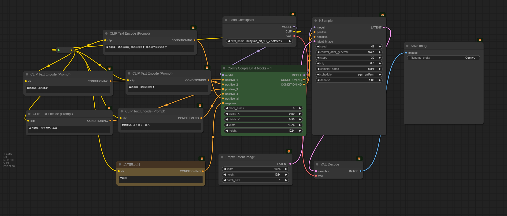

# Enhancing Image Generation Fidelity via progressive Prompts

The official code for the paper *Enhancing Image Generation Fidelity via progressive Prompts*. We add Controllable Region-Attention module to Hunyuan-DiT, and set up 2,4,9 regions for different controls of Hunyuan-Dit. It achive decent visual results and precise controlling. For better visualization and convenience in practice, we implement it base on a modular framework(ComfyUI).

### Installation

- Option1

Deploy env for ComfyUI, and cd  modified [ComfyUI folder](ComfyUI)  and start the modified ComfyUI by  `python main.py`.

About Comfy Deploy and Start,  pls referring to  [README.md](ComfyUI\README.md).

- Option2 （if you have runnable ComfyUI instance)

cp py file [models.py](comfy\ldm\hydit\models.py) to `{comfy_path}\comfy\ldm\hydit`.       

(we register the forward process of  Hunyuan-DiT)

cp -r dir [ComfyUI-ComfyCouple](ComfyUI-ComfyCouple) to`{comfy_path}\custom_nodes\`.     

(This is a custom node for Controllable Region-Attention module used in ComfyUI)

### Implemented Nodes by us

You can use this node to inference image by applying Controllable Region-Attention module to Hunyuan-DiT.

### Workflow

workflows can be found in [here](Workflow). it can be load by ComfyUI .

#### 2 region for Attention control

#### 4 region for Attention control

####  9 region for Attention control

#### Control Applied Blocks numbers in Dit

#### Thanks

[**@Danand**](https://github.com/Danand) – [original repo](https://github.com/Danand/ComfyUI-ComfyCouple). It's a couple method for SDXL.
